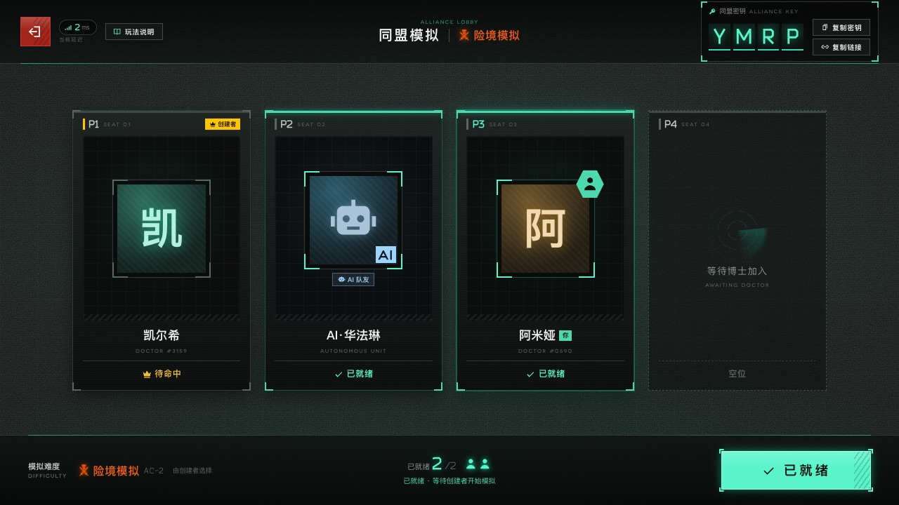
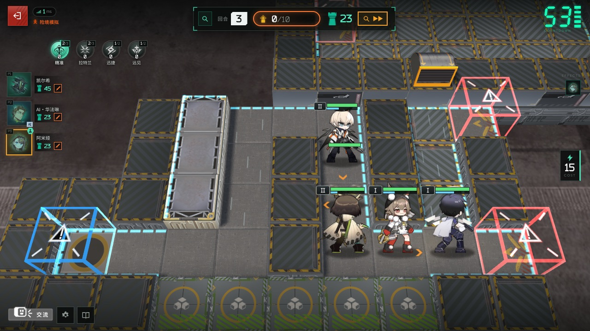

# 卫戍协议：盟约 · Stronghold Protocol: Covenant

《明日方舟》季节性自走棋塔防玩法「卫戍协议：盟约」的**同人联机网页复刻**。浏览器即开即玩：独立模拟（单人）与同盟模拟（1–4 人合作，可用 AI 队友补位），局域网 / 公网联机，一台小主机就能开服。

> 非官方同人项目，仅供学习交流，**禁止商用**。游戏素材版权归上海鹰角网络 / Yostar，**不包含在本仓库中**（在你自己的电脑上下载或提取；`docs/img/` 里只有几张说明用的游戏截图）。详见 [致谢与声明](#致谢与声明)。
> English summary: [below](#english).

| 同盟房间 | 策略轮选 | 休整期（商店 / 盟约） |
|---|---|---|
|  |  |  |
| **部署方向轮盘** | **作战** | **最终攻势** |
|  |  |  |

## 特性

- 完整的一局流程：确认本局信息 → 策略轮选（40 种策略）→ 14 回合（+ 隐秘核心）→ 结算称号。
- 4 种难度（标准 / 险境 / 绝境 / 终极），独立与同盟两套参数，数据来自官方表。
- 112 名可招募干员（+ 精锐）及技能天赋、23 个盟约与层数、特质、装备与法术、机变、10 个敌方领袖、地形装置。
- **干员调配**（大厅 / 房间 / 本局信息确认时）：和官方一样不能调整等阶，但可为每名干员选择携带的技能（283 个技能全部手工实现）与精锐的模组（或不装备）。
- 联防、最终攻势（两人共享战场与领袖血池）、隐秘核心；同盟模拟断线 10 分钟内可重连（掉线期间按原阵容自动作战，也可「暂离」交给 AI 托管），独立模拟 24 小时内可回来继续。
- 真实 Spine 小人、官方 BGM / 音效、表情（6 套 × 6 个）；可选的官方 3D 棋盘（需从本机客户端提取贴图）。
- **战斗在各玩家浏览器里模拟**（和官方一样），服务器只管经济与回合：一台低功耗 Windows 小主机即可开服。

## 快速开始

需要 **Node.js 18+**（推荐 22 或 24 LTS）和约 **400 MB** 磁盘空间。第一次启动会自动安装依赖并下载约 250 MB 素材（可中断，再次启动会续传）。

### Windows

1. 安装 Node.js：在 PowerShell 里运行 `winget install OpenJS.NodeJS.LTS`，或到 <https://nodejs.org/zh-cn/download> 下载安装包。
2. 获取代码：`git clone <本仓库地址>`，或在 GitHub 页面 *Code → Download ZIP* 后解压。
3. 双击 **`scripts\start-windows.bat`**（ZIP 下载的若弹出「安全警告」，点「运行」）。准备完成后会自动打开浏览器，窗口里会列出朋友可用的局域网地址。

   也可以用 PowerShell：`powershell -ExecutionPolicy Bypass -File scripts\start-windows.ps1`（没有 Node.js 时会提示用 winget 安装）。

开机自动在后台运行、防火墙设置、固定 IP 等见 **[docs/DEPLOY.md](docs/DEPLOY.md)**。

### macOS / Linux

```bash
git clone <本仓库地址> Stronghold-Protocol && cd Stronghold-Protocol
scripts/start.sh            # 首次：npm ci + 下载素材；然后启动服务器并打开浏览器
```

### 手动（任何系统）

```bash
npm ci                      # 安装依赖（postinstall 会把 pixi / preact / three 复制到 public/vendor）
node tools/setup.mjs        # 检查环境、下载/补全素材、（可选）从本机客户端提取官方贴图
npm start                   # http://localhost:3000
```

`node tools/doctor.mjs` 可随时诊断：Node 版本、素材是否完整、端口占用、局域网地址、防火墙提示。

## 和朋友一起玩

1. 打开页面 → 输入昵称 → **同盟模拟** → 创建房间。房主选择难度，可添加 / 移除 AI 队友。
2. 把 4 位字母的**同盟密钥**，或「复制链接」得到的 `http://<地址>:3000/?room=密钥` 发给朋友。
3. 所有人点「准备就绪」后房主开始。刷新页面 / 断线后 10 分钟内重新打开即可回到原座位（独立模拟：24 小时内，用同一个浏览器）。

**局域网**：服务器启动时会打印 `LAN: http://192.168.x.x:3000`，同一 Wi-Fi / 路由器下的朋友直接打开。打不开时多半是防火墙：Windows 首次启动时在弹窗中允许「专用网络」，或运行 `node tools/doctor.mjs` 查看具体命令。

**公网**（朋友不在同一个网络）：

| 方式 | 适合 | 做法 |
|---|---|---|
| **Tailscale / ZeroTier**（推荐） | 家里常开的小主机、固定几个朋友 | 主机和朋友都安装并加入同一个网络，朋友打开 `http://<主机的 100.x / ZeroTier IP>:3000`。无需公网 IP、不暴露到互联网、延迟低。 |
| **cloudflared 临时隧道** | 临时开一局，朋友什么都不用装 | `cloudflared tunnel --url http://localhost:3000`，把输出的 `https://xxxx.trycloudflare.com` 发给朋友。页面会自动使用 `wss://`。每次启动地址都会变。 |
| **路由器端口转发** | 有公网 IPv4 | 把路由器的 TCP 3000 转发到主机的局域网 IP，朋友访问 `http://<公网 IP>:3000`。注意安全（见 DEPLOY）。 |

详细步骤（含 Nginx / Caddy 反向代理与 HTTPS）见 [docs/DEPLOY.md](docs/DEPLOY.md)。玩法说明见 **[docs/PLAYING.md](docs/PLAYING.md)**（游戏内也有「玩法说明」）。

## 操作

| 操作 | 方法 |
|---|---|
| 购买 / 升级调度中心 | 点一次选中，再点一次确认（`D` 升级） |
| 部署 / 移动干员 | 从整备区拖到棋盘格 → 出现方向轮盘 → 往上/右/下/左滑动选择朝向后松手；松在中心或点「✕ 点击取消」取消 |
| 调整朝向 | 把干员拖回它自己的格子，再选方向 |
| 出售 / 撤退 / 销毁装备 | 点击单位 → 底部按钮「出售 +1」「撤退」；整备区里的装备与法术只能「销毁」，已配发的装备锁定在干员身上（干员出售或合成精锐时退回整备区）。也可以把棋盘上的干员拖回整备区撤退 |
| 装备 | 把装备拖到干员身上（每人 2 件；满了会弹出替换窗口，选择要替换的一件——它会被销毁）；法术拖到地块上并选方向 |
| 查看详情 | 右键或长按单位 / 卡牌 |
| 快捷键 | `R` 刷新 · `F` 冻结 · `D` 升级 · `Space` 准备就绪 · `Esc` 取消 / 关闭 |
| 方向轮盘键盘操作 | 方向键预览 · `Enter` 确认 · `Esc` 取消 |
| 暂停（独立模拟） | 作战中（含最终攻势 / 隐秘核心）点顶栏的「暂停」或按 `Space`，再点「继续作战」（或 `Space`）继续；同盟模拟的作战不能暂停 |
| 表情 | 左下角「交流」，左右滑动（或方向键）换主题，冷却 1 秒 |
| 观战 | 自己的作战结束后（或休整期）点左侧队友头像 →「前往查看」 |

手机和平板也能玩（触摸拖拽、长按查看），推荐横屏；电脑推荐 Chrome / Edge / Firefox / Safari 最新版。显卡较弱时可在「设置」里调低画质，或在网址后加 `?board=2d`（强制 2D 棋盘）/ `?render=fallback`（不用 WebGL 的简化 DOM 画面）。

## 配置

| 环境变量 | 默认 | 说明 |
|---|---|---|
| `PORT` | `3000` | 监听端口 |
| `HOST` | `0.0.0.0` | 监听地址（`127.0.0.1` = 只允许本机，放在反向代理后面时使用） |
| `SP_COMBAT` | `client` | `client`：各玩家浏览器模拟自己的战斗（官方模式，服务器负载极低）；`server`：旧的服务器模拟 + 推流模式 |
| `SP_VERIFY` | `off` | 服务器复算客户端上报的战斗结果：`off` / `sample`（约 1/8 抽查并记录）/ `all`（全部复算，不一致时以服务器为准，更耗 CPU） |
| `TRUST_PROXY` | `auto` | 是否信任 `X-Forwarded-For` 等转发头：`auto` 只信任来自本机/内网的代理（如 cloudflared、Nginx）；`1` 总是；`0` 从不 |
| `DEBUG` | 空 | 设为任意值输出详细日志 |
| `SP_NO_BROWSER` | 空 | 设为 `1` 时启动脚本不自动打开浏览器 |

设置方式：macOS / Linux `PORT=8080 npm start`；PowerShell `$env:PORT=8080; npm start`；cmd `set "PORT=8080" && npm start`；启动脚本也接受 `--port 8080`。健康检查：`GET /healthz`。

## 可选：从本机客户端提取官方贴图

如果这台电脑装有《明日方舟》PC 客户端（Windows 原生、macOS CrossOver 或 PlayCover），`node tools/setup.mjs` 会检测到并询问是否提取官方棋盘贴图、UI、表情、模组类型图标和教程图（需要 Python 3.8+，依赖安装在项目内的 `.venv-extract`，不影响系统）。之后可随时 `node tools/setup.mjs --local` 重新提取，或 `--game "<…\StreamingAssets\AB\Windows>"` 指定路径。提取结果只在本机（`public/assets/local/`、`data/local-assets.json`，均已被 git 忽略）；没有它游戏一样能玩，只是棋盘为 2D、部分 UI 用替代图（模组类型图标改为文字）。

## 测试

```bash
node --test                 # 单元 + 集成测试（约 2300 项；缺少素材 / 浏览器的用例会自动跳过）
SP_E2E=1 node --test test/ui/mock.e2e.test.js      # 需要本机 Chrome（CHROME_PATH 可指定路径）
SP_REAL_E2E=1 node --test test/ui/real.e2e.test.js # 需要 Chrome + 已下载素材
```

GitHub Actions（[.github/workflows/ci.yml](.github/workflows/ci.yml)）在 Ubuntu 与 Windows 上运行 `npm ci`、`node --test` 和服务器冒烟测试。

## 项目结构

| 路径 | 内容 |
|---|---|
| `server/` | Node HTTP 静态服务 + WebSocket（`/ws`）、大厅、对局引擎（`match/`）、战斗模拟（`sim/`，浏览器与服务器共用） |
| `shared/` | 前后端共用的常量与网络协议 |
| `public/` | 浏览器客户端（原生 ES 模块，PixiJS + pixi-spine、three.js 3D 棋盘、Preact + htm UI） |
| `data/` | 由官方数据表生成的游戏数据（`tools/build-data.mjs`）与素材清单 `assets.json` |
| `tools/` | `setup.mjs` / `doctor.mjs`、素材下载 `fetch-assets.mjs`、数据构建、本地提取 `local-extract/` |
| `scripts/` | 启动脚本（Windows / macOS / Linux）、Windows 开机自启 |
| `docs/` | [DESIGN](docs/DESIGN.md)（架构与契约）· [DEPLOY](docs/DEPLOY.md) · [PLAYING](docs/PLAYING.md) · [ASSETS](docs/ASSETS.md) · [DATA](docs/DATA.md) · `research/` |
| `test/` | `node:test` 测试 |

## 致谢与声明

- 《明日方舟》及「卫戍协议」相关的全部名称、角色、美术、音频与数据版权归 **上海鹰角网络科技有限公司（Hypergryph）** 及其授权方（Yostar 等）所有。本项目为非官方、非商业的爱好者作品，与官方无任何关联；如有侵权请联系删除。
- **本仓库不包含游戏素材文件**（`docs/img/` 中的几张游戏截图仅用于说明）：美术 / 音频 / 字体由 `tools/fetch-assets.mjs` 在使用者本机下载，本地客户端贴图由使用者自行提取，均被 `.gitignore` 排除。请勿把 `public/assets/` 等目录上传或再分发。
- 游戏数据：[Kengxxiao/ArknightsGameData](https://github.com/Kengxxiao/ArknightsGameData)。
- 素材来源：[yuanyan3060/ArknightsGameResource](https://github.com/yuanyan3060/ArknightsGameResource)、[fexli/ArknightsResource](https://github.com/fexli/ArknightsResource)、[isHarryh/Ark-Models](https://github.com/isHarryh/Ark-Models)、[ArknightsAssets/ArknightsAssets2](https://github.com/ArknightsAssets/ArknightsAssets2)；字体来自 [TimWangZi/The-font-of-Arknights](https://github.com/TimWangZi/The-font-of-Arknights) 与 Google Fonts（Noto Sans SC）。详见 [docs/ASSETS.md](docs/ASSETS.md)。
- LZ4AK 解包：`tools/local-extract/aklz4.py` 的算法来自 [isHarryh/Ark-Unpacker](https://github.com/isHarryh/Ark-Unpacker)（BSD-3-Clause，经 MooncellWiki/UnityPy）；解析 Unity 资源使用 [UnityPy](https://github.com/K0lb3/UnityPy)（MIT）。
- 库：[PixiJS](https://pixijs.com/)（MIT）、[pixi-spine](https://github.com/pixijs/spine)（MIT；其中包含的 Spine Runtime 代码另受 [Spine Runtimes License](https://esotericsoftware.com/spine-runtimes-license) 约束，其中有关于 Spine 编辑器授权的条款，公开发布前请自行阅读）、[three.js](https://threejs.org/)（MIT）、[Preact](https://preactjs.com/) + [htm](https://github.com/developit/htm)（MIT）、[ws](https://github.com/websockets/ws)（MIT）。这些库通过 npm 安装，不随仓库提交。
- **代码许可证：TODO（由仓库所有者选择，例如 MIT / GPL-3.0；在此之前仓库中的代码保留所有权利）。** 无论选择哪种，上面的游戏素材与第三方内容都不在其范围内。

---

## English

A fan-made, online co-op browser remake of Arknights' seasonal auto-chess tower-defense mode *Stronghold Protocol: Covenant*. Solo and 1–4 player co-op (AI teammates fill seats), played over LAN or the internet. Combat is simulated in each player's browser (like the official client), so a low-power mini PC can host.

- **Run:** Node.js 18+ (22 or 24 LTS recommended). Windows: double-click `scripts\start-windows.bat`. macOS/Linux: `scripts/start.sh`. Manual: `npm ci && node tools/setup.mjs && npm start` → <http://localhost:3000>. First start downloads ~250 MB of game art (resumable). `node tools/doctor.mjs` diagnoses ports, assets, LAN addresses and firewall.
- **Friends:** create a co-op room and share the 4-letter code or the `?room=CODE` link. A dropped player can rejoin within 10 minutes (co-op) or resume a solo run within 24 hours (same browser; the server keeps everything in memory, so a restart ends all runs). LAN: use the printed `LAN:` URL. Internet: Tailscale/ZeroTier (recommended), `cloudflared tunnel --url http://localhost:3000` (wss handled automatically) or port forwarding — see [docs/DEPLOY.md](docs/DEPLOY.md).
- **Env:** `PORT`, `HOST`, `SP_COMBAT=client|server`, `SP_VERIFY=off|sample|all`, `TRUST_PROXY=auto|1|0`, `DEBUG`.
- **Disclaimer:** unofficial and non-commercial. Game names, art, audio and data © Hypergryph / Yostar; **no game art/audio/font files are in this repository** (only a few screenshots in `docs/img/`) — they are downloaded or extracted locally and git-ignored. Code licence: TODO (owner to choose).
